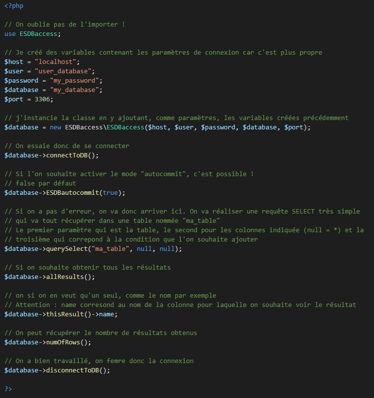

# ESDBaccess
ESDBaccess est un ORM (Object Relational Mapping) écrit en PHP et utilisant le moteur de bases de données MySQLi. Il est simple d'utilisation, léger et sécurisé.

Il permet d'effectuer plus facilement des requête vers une base de données.

Cette librairie nécessite PHP 7.1 au minimum

## Installation

Afin d'utiliser cet ORM, vous devez disposer d'une application utilsant le langage PHP 7.1 au minimum ainsi que d'une base de données sous MySQL/MariaDB.

L'installation est simple, il vous suffit de cloner ce dépôt en vous rendant dans votre projet et en insérant la commande suivante dans un terminal (Windows, Mac ou Linux): 

**Assurez-vous d'avoir installé Git avant de lancer la commande ci-dessous !**

```
git clone https://github.com/Vanhaex/ESDBaccess.git
```

Ou alors, si vous avez installée Composer : 

```
composer require vanhaex/esdbaccess
```

Une fois que vous avez cloné le dépôt avec succès, vous pouvez suivre le tutoriel ci-dessous afin d'apprendre à utiliser l'ORM.

## Tutoriel

<br>

<p align="center">
  
</p>


